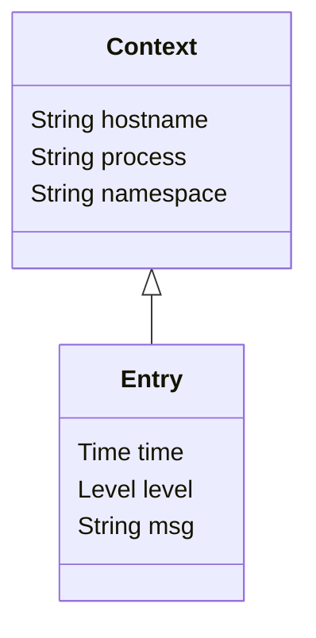

# Semantic Logs

## Summary 

Today, there are many log encodings. This creates O(nm) cost and complexity parsing and processing log files. Every log encoding (n) multiplied by the number of log processing product (m).

To manage this we introduce two concepts. Firstly, **structured logs** allows parsing of logs into general key-value entries. That allows both humans and machines to understand the **syntax** of log entries. Then a specialization of structured logs we call **semantic logs** gives clear meaning to key-values pairs that allows both humans and machine to perform unambiguous analysis and processing of generalised log entries. 

By standardising, it becomes orders of magnitude easier to build tools for common use cases:

* Log viewing
* Log analytics
* Distributed tracing
* Auditting
* Security analysis

Structured logs are logs where each entry has context-free syntax. A counter example would be a CSV file. Fields within records within a CSV file can only be understood within the context of the headers. Conversely, JSON object values can be understood by examining the keys. 

Logs entries are events, but events are not entries. 

## Structured, Patterned, and Free-Text Logs

Today, you'll commonly see three types of logs:

* **Structured** each entry is made up of key-value pairs, e.g. `time=2022-12-10T14:15:00Z level=info msg="Hello world"`, also known as `logfmt`. These logs can be parsed into structure only knowing they're structured.
* **Patterned** each entry is a formatted line of text, e.g. `[2022-12-10T14:15:00Z] [info] Hello world`. These logs cannot be parsed into structure without knowing (a) they are patterned and (b) the pattern. Some patterned logs cannot be parsed into structure.
* **Free-text** arbitrary text, e.g. `Hello world`. These logs cannot be parsed into structure.

## Semantic Log Entry

To add semantics, we must define the meaning and type of specific keys.

Mandatory:

* `time` When the log entry was created (RCF339 timestamp). 
* `level` The severity of the event. `error`, `warn`, `info` or `debug`. 
* `msg` Human readable message describing the entry.

Optional keys:

* `thread` The thread to Coroutine name.
* `logger` The logger name.

### `time`

Log entries are ordered. When two entries are logged at the same `time`, `time` alone is not be enough to show order.

`timestamp` and `ts` are synonyms. 

### `level`

One of :

* `error` The application has encountered an error. These errors should be reported to a human and the human should take action.
* `warn` A warning. Warning do not need to be raised with a human. 
* `info` Informational.
* `debug` Debugging diagnotics. Typcially no logged in production systems. 

How does this interact with `stdout` and `stderr`?

* `stdout` Messages are implied to be at `info` level.
* `stderr` message are impllied at `error` level.

Non-standard levels:

* `fatal` An error message where the applicatino exits with error status. Similar to `error` with error exit status.
* `warning` Synonym for `warn`.
* `notice` Prefer `info`.
* `trace` Prefer `debug`. 

These synonym result in loss of information, but this is considered an acceptable trade-off for convention.

`severity` is a synonym. 

### `msg`

Human reable text. 

Messages should be from a small finite set of options. Messages should not be formatted, because that would allow infinite messages.

* Invalid: `time=2022-12-10T14:15:00Z level=info msg="Hello harry123"`
* Valid: `time=2022-12-10T14:15:00Z level=info msg="Hello" userid=harry123`

`message` is a synonym.

## Extensions

### Audit

The source of a request:

* `client_ip` The originating IP.
* `username` The user name requesting access.
* `resource` The resource being accessed.

### OpenTracing

* `trace_id` The trace ID.
* `span_id` The span ID.

## Encodings

### `logfmt`

Printed as key-value pairs, e.g. `time=2022-12-10T14:15:00Z level=info msg="Hello world"`.

### JSON

Printed as JSON stream, e.g. `{"time": "2022-12-10T14:15:00Z", "level": "info", "msg": "Hello world"}`.

JSON is always more verbose than `logfmt`; 30% in the above example. 

## Log Context

Logs are always created by a process and therefore never created without context:

Log context is key-value pairs:

* The `hostname` of the process.
* The `process` name.
* The process `namespace`.

## Diagram

## Mapped Diagnostic Context

Semantic logging has no opinion on this. It is just more key-value pairs.

## Line Numbers

Logs don't have meaningful line numbers. 

## Indexing

TODO

## Free-text Search

Free-text may not need to be supported with semantic logs, because they're always structured.
