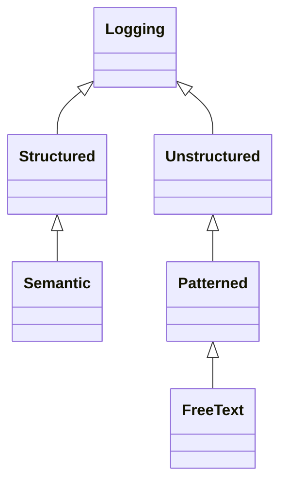
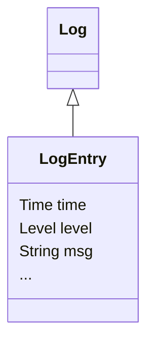
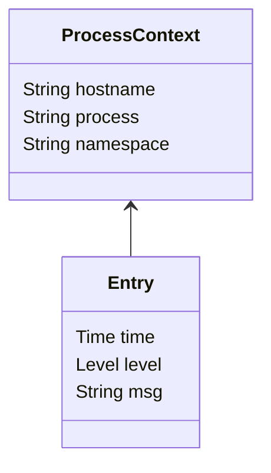

# Semantic Logs

## Summary 

Today, there are many log encodings. This creates O(nm) cost and complexity parsing and processing log files. Every log encoding (n) multiplied by the number of log processing products (m).

To manage this we introduce two concepts:

1. Firstly, **structured logs** allows parsing of logs into general key-value entries. That allows both humans and machines to understand the **syntax** of log entries.
2. Then a specialization of structured logs we call **semantic logs** which specifies meanings and data-types to key-values pairs. This allows both humans and machine to perform unambiguous analysis and processing of log entries. 

By standardising, it becomes straight forward to build tools for common use cases:

* Log viewing
* Log analytics
* Distributed tracing
* Auditting
* Reporting
* Security analysis

Logs entries are events, but events are not entries. 

This specification does not mandate any encoding of log entries. Both Logfmt and JSONL correctly encode structured logs. Examples in this document use Logfmt for brevity and human-readability.

## Structured, Patterned, and Free-Text Logs

Today, you'll commonly see three types of logs:

* **Structured** each entry is made up of key-value pairs, e.g. `time=2022-12-10T14:15:00Z level=INFO msg="Hello world"`. These logs can be parsed into structure only knowing they're structured.
* **Patterned** each entry is a formatted line of text, e.g. `[2022-12-10T14:15:00Z] [INFO] Hello world`. These logs cannot be parsed into structure without knowing (a) they are patterned and (b) the pattern. 
* **Free-text** arbitrary text, e.g. `Hello world`. These log entries do not have a time-stamp or logging level associated with them.



## Type System

- Log entries are key-value pairs.
- Keys must be `string` type.
- Keys should be lower-case.
- Keys must not contain white-space.
- Keys maybe grouped. E.g. dot-delimited: `name.first`.
- Values must be a printable types.
- Values that are dates should be in RCF339 format.
- Values that are durations should be in seconds, milliseconds, or ISO 8601.



## Fields

The different between structured logging and semantic logging is that semantic logging defines the meaning and type of certain keys.

Fields are grouped as follows:

* **Core fields** include fields that should appear in any log entry and have sematic meaning. These fields are typcially mandatory.
* **Extension fields** are optional fields that may appear and have sematic meaning.
* **Custom fields** are all other optional fields and may have semantic meaning.

### Core Fields

Core fields exist in the top-level group. Most core fields are mandatory. Only core fields can be mandatory.

#### `time`

When the log entry was created (RCF339 timestamp). 

Log entries are ordered. When two entries are logged at the same `time`, `time` alone is not be enough to show order.

`timestamp` and `ts` are synonyms. 

Mandatory.

#### `level`

One of:

* `ERROR` The application has encountered an error. These errors should be reported to a human and the human should take action.
* `WARN` A warning. Warning do not need to be raised with a human. 
* `INFO` Informational.
* `DEBUG` Debugging diagnotics. Only for debugging. Do not need to be machine-readable. Typcially not logged in production systems, nor used for reporting purposes.

How does this interact with `stdout` and `stderr`?

* `stdout` Messages are implied to be at `info` level.
* `stderr` message are impllied at `error` level.

Non-standard levels:

* `FATAL` An error message where the application exits with error status. Similar to `ERROR` with error exit status.
* `WARNING` Synonym for `WARN`.
* `NOTICE` Prefer `INFO`.
* `TRACE` Prefer `DEBUG`. 

`severity` is a synonym. 

Mandatory.

#### `msg`

Human-readble text. 

Messages should be from a small finite set of options. The number of possible messages an application logs at >= `WARN` should be finite, so that aggregate reports can be generated (e.g. `stats count by msg`).

Message is the **only** field which may be a multi-line string.

`message` is a synonym.

Mandatory.

### Source Code Debugging

#### `source` & `line`

* `source` The source file that created the log entry.
* `line` The number within the source file that created the log entry. Must be an integer greater than zero.

Optional. Determining source/line can be very expensive unless added using macros at compile time.

### Transaction ID

#### `tid`

The transaction ID. A string.

Optional.

### Tracing

#### `trace_id` and `span_id`

Rather than logging thread or Corountine ID, log these.

* `trace_id` The trace ID.
* `span_id` The span ID.

Optional.

### Audit

WIP

The source of a request:

* `audit.client_ip` The originating IP.
* `audit.username` The user name requesting access.
* `audit.resource` The resource being accessed.

Optional.

### Process Context

Logs are always created by a process and therefore always created with context:

Log context is key-value pairs:

* The `hostname` of the process.
* The `process` name.
* The process `namespace`.



## Line Numbers

Log files don't have meaningful line numbers. 

## Indexing

Semantic logs entries are intended to be queried. As a result, logging facilities may need to index log entries.

## Free-text Search

Free-text may not need to be supported with semantic logs, because they're always structured.

## Eschewed Fields

The following field are eschewed:

### `thread`

The thread or Coroutine. 

Rational: Uses tracing instead. This covers more use cases, and can allows tracing to span thread boundaries.

### `logger`

The name of the logger that created the entry.

Rational: `source` + `line` provide better diagnostics.

#### `error`

It is common for `error` level entries to include the error itself. This allows output of more diagnostics, such as stack traces. In Java this would be a `Throwable` in Go an `error`. 

Stack-traces are typcially multi-line strings.

Rational: strack traces can only be appenedd to the message field.

`err` is a synonym.

## Encodings

This specification does not mandate any encoding of log entries

### Logfmt

Printed as key-value pairs, e.g. `time=2022-12-10T14:15:00Z level=INFO msg="Hello world"`.

Notes:

* Human-readable.
* Most compact human-readable encoding possible.

Logfmt entries are one ore more lines long. A line is grouped with the previous line when any mandatory field is missing. The extra lines are appended with their leading new line to the message field

```
time=2022-12-10T14:15:00Z level=INFO msg="Hello world"
This is an example of a multi-line message.
```

### JSONL

Printed as JSON stream, e.g. `{"time": "2022-12-10T14:15:00Z", "level": "INFO", "msg": "Hello world\nThis is an example of a multi-line message."}`.

Notes:

* JSON is always more verbose than Logfmt, between 10% and 30%
* Easier to write parsers and printers for JSON as the JSON libraries are typcially well-tested and will deal with escaping. 
