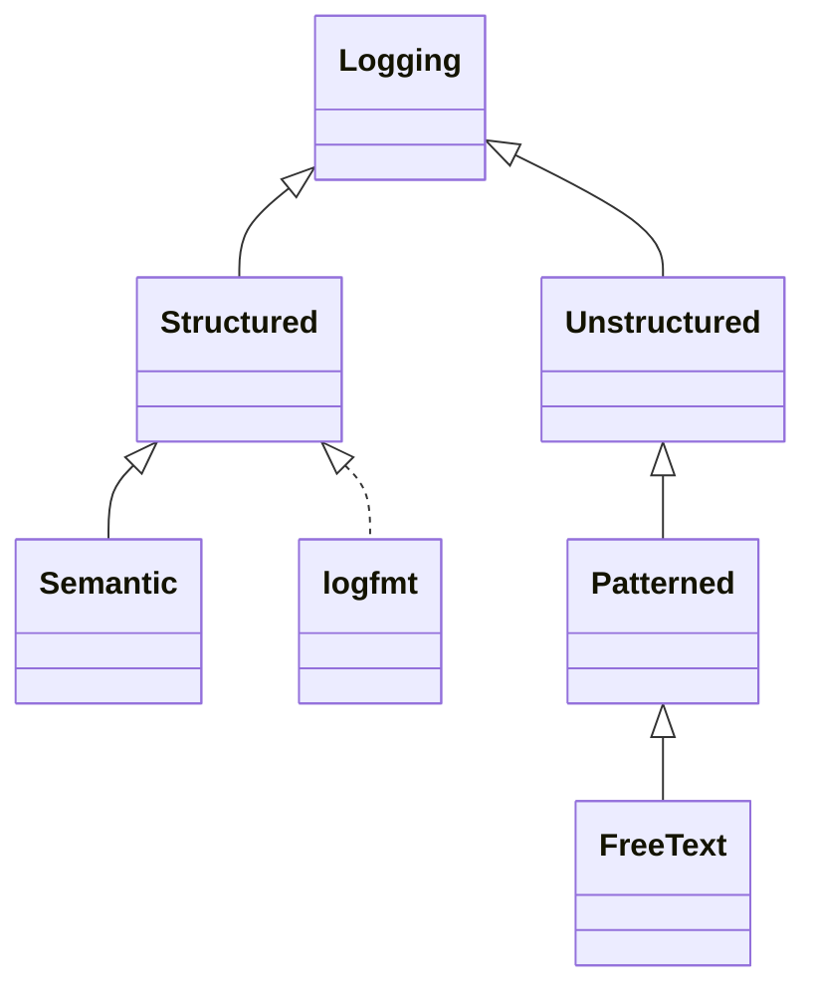
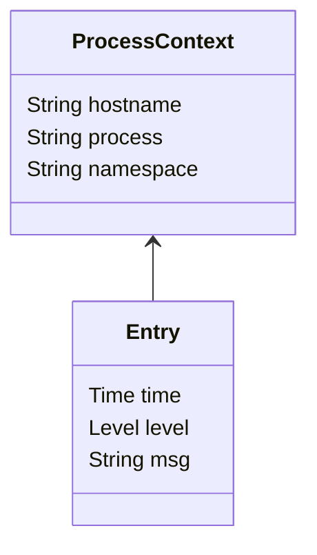

# Semantic Logs

## Summary 

Today, there are many log encodings. This creates O(nm) cost and complexity parsing and processing log files. Every log encoding (n) multiplied by the number of log processing product (m).

To manage this we introduce two concepts. Firstly, **structured logs** allows parsing of logs into general key-value entries. That allows both humans and machines to understand the **syntax** of log entries. Then a specialization of structured logs we call **semantic logs** gives clear meaning to key-values pairs that allows both humans and machine to perform unambiguous analysis and processing of generalised log entries. 

By standardising, it becomes orders of magnitude easier to build tools for common use cases:

* Log viewing
* Log analytics
* Distributed tracing
* Auditting
* Security analysis

Structured logs are logs where each entry has context-free syntax. A counter example would be a CSV file. Fields within records within a CSV file can only be understood within the context of the headers. Conversely, JSON object values can be understood by examining the keys. 

Logs entries are events, but events are not entries. 

## Structured, Patterned, and Free-Text Logs

Today, you'll commonly see three types of logs:

* **Structured** each entry is made up of key-value pairs, e.g. `time=2022-12-10T14:15:00Z level=INFO msg="Hello world"`, sometimes known as `logfmt`. These logs can be parsed into structure only knowing they're structured.
* **Patterned** each entry is a formatted line of text, e.g. `[2022-12-10T14:15:00Z] [INFO] Hello world`. These logs cannot be parsed into structure without knowing (a) they are patterned and (b) the pattern. Some patterned logs cannot be parsed into structure.
* **Free-text** arbitrary text, e.g. `Hello world`. These logs cannot be parsed into a structured form.

## Types

- Log entries are key-value pairs.
- Log lines are a space separated list of log entries. 
- Log lines are-new line terminated.
- Keys or values that contain spaces must be quoted.
- Keys must be `string` type.
- Keys should be lower-case.
- Keys should not contain white-space.
- Keys maybe grouped. Groups are dot-delimited prefix. E.g. `name.first`.
- Values that contain new lines will need to be escaped.
- Values must be a printable type. 
  - Primitive types such as `string`, `number`, and `boolean`
  - `object` where the object has a printing method, e.g `toString()` in Java or `String()` in Go.
  - `array` where the objects are printable.
- Values cannot be `null`. It is not possible to differentiant a `string` from `null`.
- Values that are dates must be in RCF339 format.
- Values that are durations must be in seconds.

## Fields

The different between structured logging and semantic logging is that semantic logging defines the meaning and type of certain keys.

### Core

Core fields exist in the top-level group. Some core fields are mandatory. Only core fields can be mandatory.

#### `time`

When the log entry was created (RCF339 timestamp). 

Log entries are ordered. When two entries are logged at the same `time`, `time` alone is not be enough to show order.

`timestamp` and `ts` are synonyms. 

Mandatory.

#### `level`

One of:

* `ERROR` The application has encountered an error. These errors should be reported to a human and the human should take action.
* `WARN` A warning. Warning do not need to be raised with a human. 
* `INFO` Informational.
* `DEBUG` Debugging diagnotics. Typcially no logged in production systems. 

How does this interact with `stdout` and `stderr`?

* `stdout` Messages are implied to be at `info` level.
* `stderr` message are impllied at `error` level.

Non-standard levels:

* `FATAL` An error message where the application exits with error status. Similar to `error` with error exit status.
* `WARNING` Synonym for `WARN`.
* `NOTICE` Prefer `INFO`.
* `TRACE` Prefer `DEBUG`. 

`severity` is a synonym. 

Mandatory.

#### `msg`

Human readble text. 

Messages should be from a small finite set of options. Messages should not be formatted, because that would allow infinite messages.

* Discouraged: `time=2022-12-10T14:15:00Z level=INFO msg="Hello harry123"`
* Encouraged: `time=2022-12-10T14:15:00Z level=INFO msg="Hello" userid=harry123`

`message` is a synonym.

Mandatory.

#### `error`

It is common for `error` level entries to include the error itself. This allows output of more diagnostics, such as stack traces. In Java this would be a `Throwable` in Go an `error`. 

Stack-traces are typcially multi-line strings.

`err` is a synonym.

Optional.

#### `source` & `line`

WIP

* `source` The source file that created the log entry.
* `line` The number within the source file that created the log entry. Must be an integer.

Optional. Determining source/line can be very expensive unless added using macros at compile time.

#### `trace_id` and `span_id`

Rather than logging thread or Corountine ID, log these.

* `trace_id` The trace ID.
* `span_id` The span ID.

Optional.

### Audit

WIP

The source of a request:

* `audit.client_ip` The originating IP.
* `audit.username` The user name requesting access.
* `audit.resource` The resource being accessed.

Optional.

## Encodings

### `logfmt`

Printed as key-value pairs, e.g. `time=2022-12-10T14:15:00Z level=INFO msg="Hello world"`.

### JSON

Printed as JSON stream, e.g. `{"time": "2022-12-10T14:15:00Z", "level": "INFO", "msg": "Hello world"}`.

JSON is always more verbose than `logfmt`; 30% in the above example. 

It may be easier to write parsers and printers for JSON as the JSON libraries are typcially well-tested and will deal with escaping. 

## Process Context

Logs are always created by a process and therefore always created with context:

Log context is key-value pairs:

* The `hostname` of the process.
* The `process` name.
* The process `namespace`.

## Log Context

Log context is context carried around between functions. In Java this is known as Mapped Diagnostic Context. In Go `context.Context`. Semantic logging has no opinion on this. It is just more key-value pairs.

## Line Numbers

Log files don't have meaningful line numbers. 

## Indexing

Semantic logs entries are intended to be queried. As a result, logging facilities may need to index log entries.

## Free-text Search

Free-text may not need to be supported with semantic logs, because they're always structured.

## Eschewed Fields

The following field are eschewed:

### `thread`

The thread or Coroutine. 

Rational: Uses trace instead. This covers more use cases.

### `logger`

The name of the logger that created the entry.

Rational: `source` + `id` provide better diagnostics.
